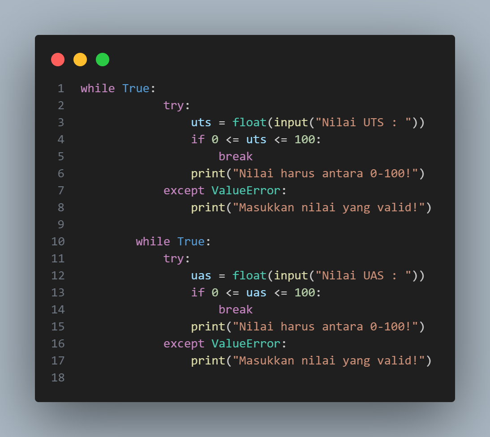
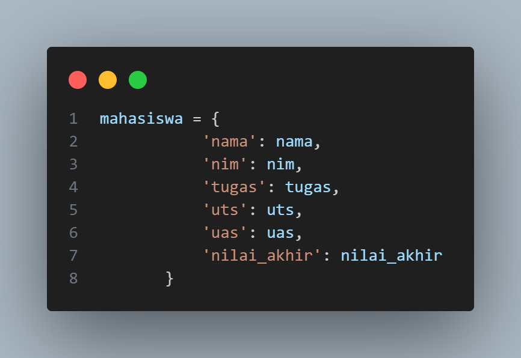
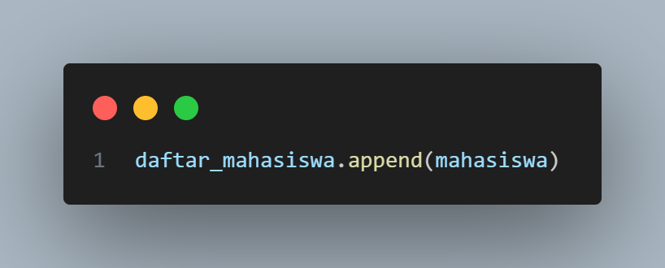

# Data Diri

Nama    : Zizantara Arzeva Cakra Kahana

Nim     : 312410398

Kelas   : TI,24,A.3

# Flowchart

# Program Mahasiswa Data Nilai Mahasiswa

Program ini dibuat untuk mengelola data nilai mahasiswa dengan kemampuan untuk menambahkan data secara dinamis dan menghitung nilai akhir berdasarkan komponen-komponen nilai yang telah ditentukan.

## Deskripsi Program 

### 1. Struktur Fungsi 

#### Fungsi hitung_nilai_akhir

Fungsi untuk menghitung nilai akhir dengan bobot :

* Tugas : 30%
* UTS   : 35%
* UAS   : 35%

#### Fungsi tampilkan_daftar

* Fungsi untuk menampilkan data dalam format tabel
* Menggunakan string formatting untuk alignment
* Memformat output dengan lebar kolom yang sesuai

#### Fungsi Main

* Fungsi utama yang menjalankan program
* Menginisialisasi list daftar_mahasiswa
* Mengatur logika input dan validasi data

### 2. Validasi Input 

#### Validasi Nilai Tugas 

* Memastikan input berupa angka (float)
* Validasi range nilai 0-100
* Penanganan error untuk input tidak valid

#### Validasi Nilai UTS dan UAS

* Menggunakan struktur validasi yang sama dengan nilai tugas
* Memastikan semua nilai dalam range yang valid

### 3. Penyimpanan Data

#### Struktur Dictionary

* Menyimpan data mahasiswa dalam dictionary
* Memudahkan akses dan pengelolaan data

#### Penambahan Data

* Menambahkan dictionary ke dalam list daftar_mahasiswa

### 4. Fitur Program

#### 1. Validasi Input yang Ketat:

* Memastikan input nilai berupa angka
* Mengecek range nilai (0-100)
* Pesan error yang informatif

#### 2. Fleksibilitas Input:

* Dapat menambah data berulang kali
* Konfirmasi untuk penambahan data baru

#### 3. Format Output yang Rapi:

* Tabel dengan alignment yang tepat
* Header dan footer yang jelas
* Pemformatan nilai dengan presisi desimal

#### 4. Penanganan Error:

* Try-except untuk menangani ValueError
* Pesan error yang user-friendly
* Loop untuk memastikan input valid