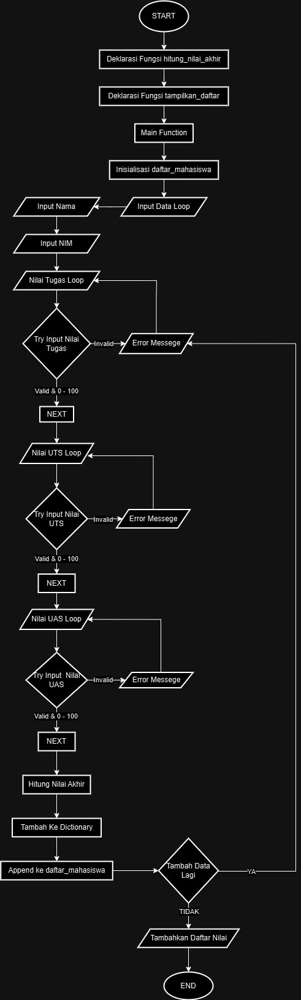
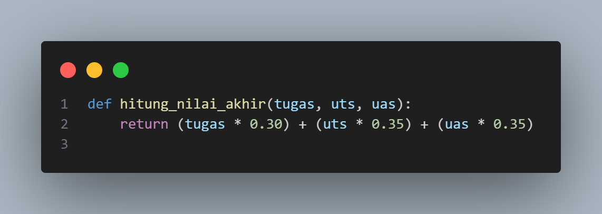

# Data Diri

Nama    : Zizantara Arzeva Cakra Kahana

Nim     : 312410398

Kelas   : TI,24,A.3

# Flowchart

# Program Mahasiswa Data Nilai Mahasiswa

Program ini dibuat untuk mengelola data nilai mahasiswa dengan kemampuan untuk menambahkan data secara dinamis dan menghitung nilai akhir berdasarkan komponen-komponen nilai yang telah ditentukan.

## Deskripsi Program 

### 1. Struktur Fungsi 

#### Fungsi hitung_nilai_akhir

#### Input

Fungsi untuk menghitung nilai akhir dengan bobot :

* Tugas : 30%
* UTS   : 35%
* UAS   : 35%

#### Fungsi tampilkan_daftar

